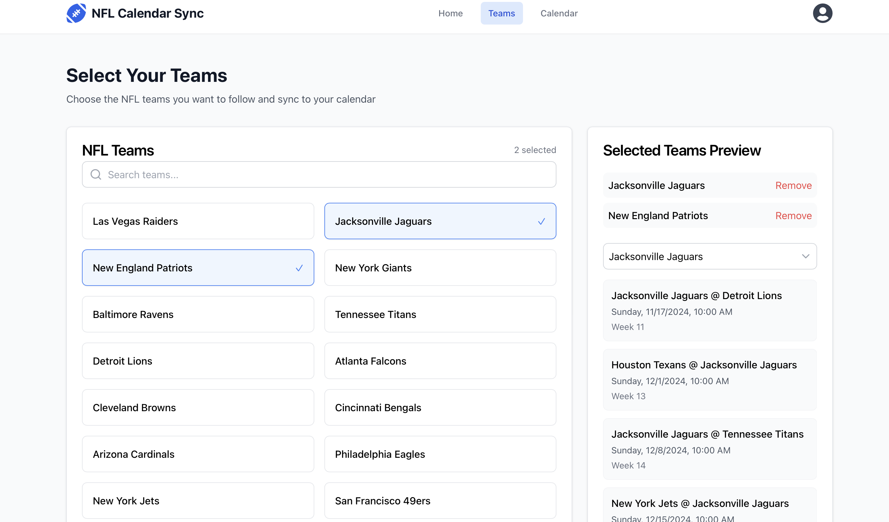
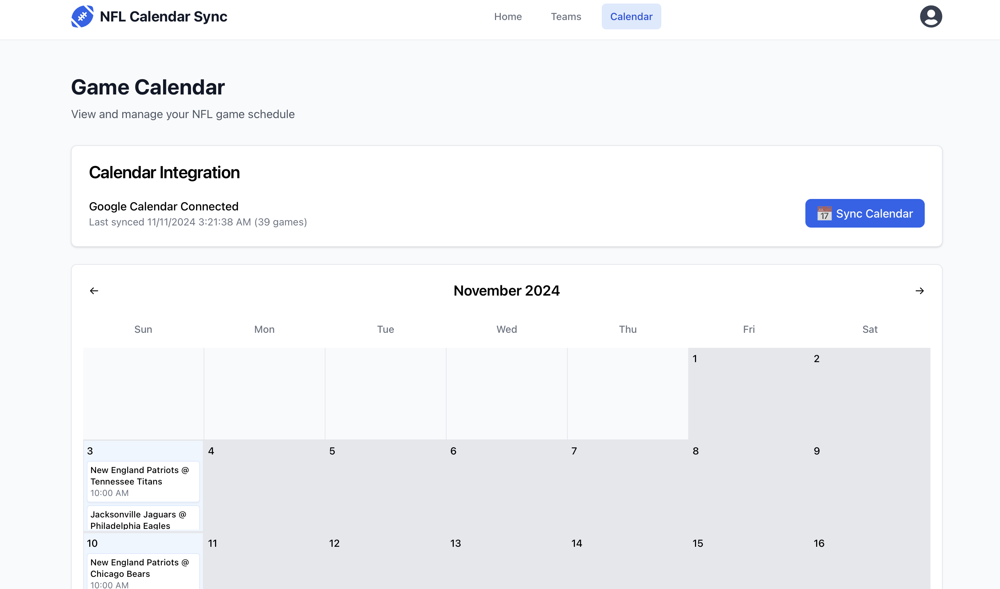

# NFL Calendar Sync Application

A full-stack application that allows users to sync their favorite NFL teams' schedules with Google Calendar.

## Project Structure
- `backend/` - FastAPI backend server
- `frontend/` - React frontend application

## Getting Started

### Backend Setup
1. Navigate to the backend directory:
```bash
cd backend
```
2. Create a virtual environment:
```bash
python -m venv venv
source venv/bin/activate # On Windows: venv\Scripts\activate
```
3. Install dependencies:
```bash
pip install -r requirements.txt
```
4. Set up environment variables:
```bash
cp .env.example .env
# Edit .env with your configuration
```
5. Run the backend server:
```bash
uvicorn main:app --reload
```

### Frontend Setup
1. Navigate to the frontend directory:
```bash
cd frontend
```
2. Install dependencies:
```bash
npm install
```
3. Set up environment variables:
```bash
cp .env.example .env
# Edit .env with your configuration
```
4. Run the development server:
```bash
npm run dev
```

## Development
- Backend API runs on: http://localhost:8000
- Can test Backend API with http://localhost:8000/docs
- Frontend development server runs on: http://localhost:5173

## Features

### 1. User Authentication & Onboarding
Clean and intuitive login interface with Google Calendar integration capabilities.


### 2. Team Selection *** May have to refresh for header to show up ****
- Interactive team selection interface
- Search functionality to find teams quickly
- Real-time preview of selected teams' schedules
- Easy team management with add/remove capabilities



### 3. Calendar Integration & Schedule Management
- Google Calendar sync functionality
- Monthly calendar view of all games
- Automatic time zone handling
- Visual indicators for game days
- Instant sync status updates



### Key Features
- **Seamless Calendar Integration**: One-click sync with Google Calendar
- **Real-time Schedule Updates**: Always up-to-date NFL game schedules
- **Team Management**: Easy selection and management of favorite teams
- **Responsive Design**: Works on desktop and mobile devices
- **Automatic Time Zone Handling**: Shows game times in your local time zone
- **Visual Game Preview**: See upcoming games in an easy-to-read format

## Technologies Used
- **Frontend**: React, TailwindCSS
- **Backend**: FastAPI, MongoDB
- **Authentication**: JWT, Google OAuth
- **External APIs**: NFL API, Google Calendar API